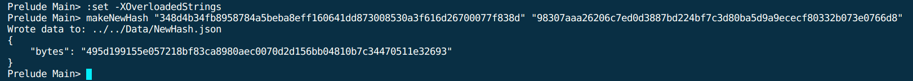
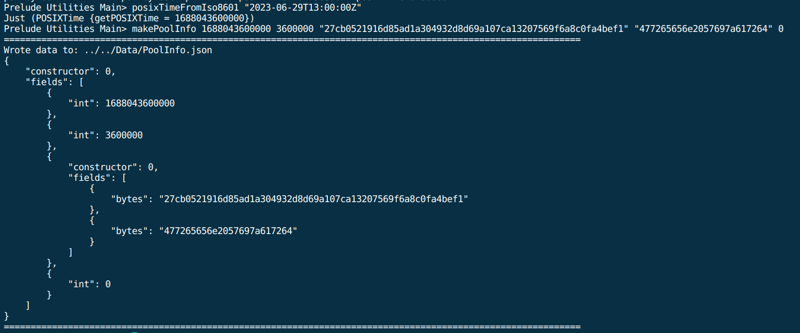
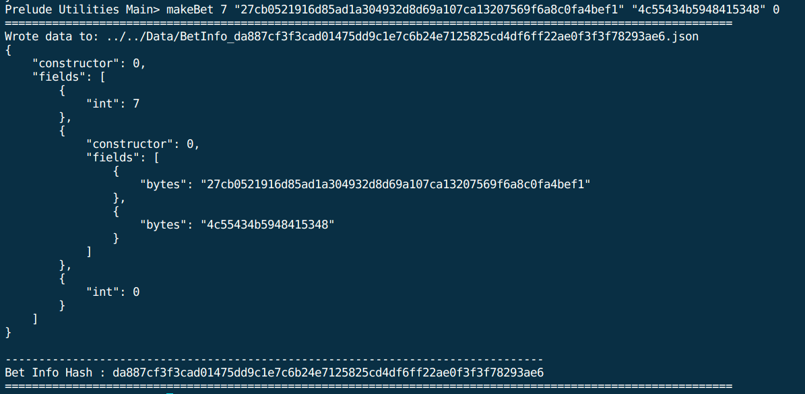
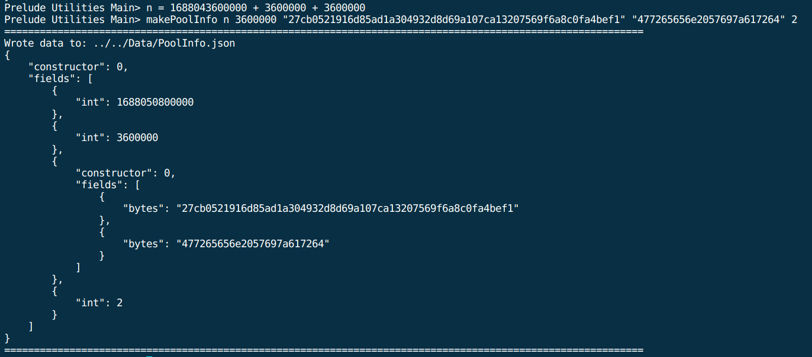
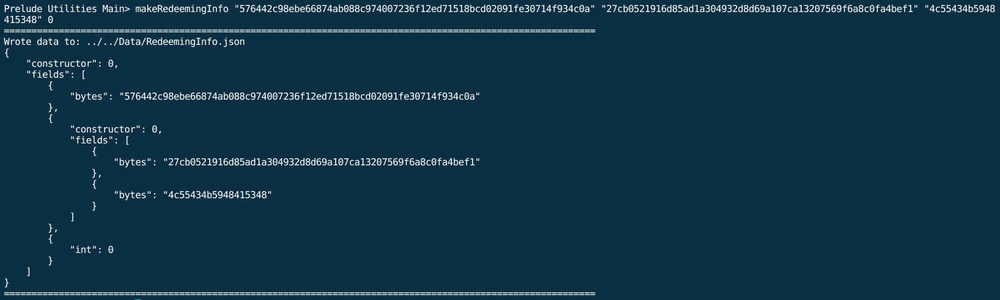
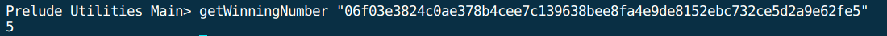
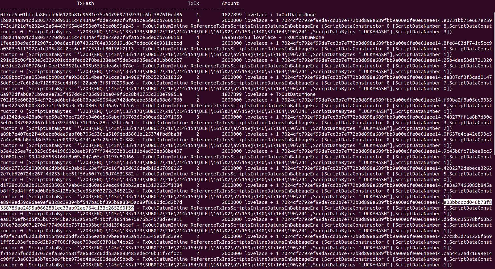

# Step-by-Step Walkthrough Example

## Table of Contents
- [Step-by-Step Walkthrough Example](#step-by-step-walkthrough-example)
  - [Table of Contents](#table-of-contents)
  - [1 - Generate User Addresses](#1---generate-user-addresses)
  - [2 - Update variables.sh](#2---update-variablessh)
  - [3 - Build Smart Contract Addresses](#3---build-smart-contract-addresses)
    - [Prerequisites:](#prerequisites)
      - [- Update variables.sh:](#--update-variablessh)
    - [CLI:](#cli)
  - [4 - Initialize Random Generator (Optional)](#4---initialize-random-generator-optional)
    - [Prerequisites:](#prerequisites-1)
      - [- Mint NFT:](#--mint-nft)
      - [- Update variables.sh:](#--update-variablessh-1)
    - [CLI:](#cli-1)
  - [4.5 - Shuffle (Optional)](#45---shuffle-optional)
    - [Prerequisites:](#prerequisites-2)
      - [- Generate Required Data:](#--generate-required-data)
      - [- Update variables.sh:](#--update-variablessh-2)
    - [CLI:](#cli-2)
  - [5 - Initialize New Game](#5---initialize-new-game)
    - [Prerequisites:](#prerequisites-3)
      - [- Mint NFT:](#--mint-nft-1)
      - [- Generate Required Data:](#--generate-required-data-1)
      - [- Update variables.sh:](#--update-variablessh-3)
    - [CLI:](#cli-3)
  - [Make A Bet](#make-a-bet)
    - [Prerequisites:](#prerequisites-4)
      - [- Generate Required Data:](#--generate-required-data-2)
      - [- Update variables.sh:](#--update-variablessh-4)
    - [CLI:](#cli-4)
  - [Make First Bet](#make-first-bet)
    - [Prerequisites:](#prerequisites-5)
      - [- Generate Required Data:](#--generate-required-data-3)
      - [- Update variables.sh:](#--update-variablessh-5)
    - [CLI:](#cli-5)
  - [Redeeming The Jackpot](#redeeming-the-jackpot)
    - [Prerequisites:](#prerequisites-6)
      - [- Update variables.sh:](#--update-variablessh-6)
    - [CLI:](#cli-6)
- [-----   END   -----](#--------end--------)

## 1 - Generate User Addresses

To generate an address, use the following command:

* `$ ./generate-Address.sh <destination> <name>`

Example:

To remove an address, use the following command:

* `$ ./remove-Address.sh <destination> <name>`

Example:

## 2 - Update variables.sh

Note : If you generated the addresses "wallet" and "collateral" as in the example above, then no need to update the path.

* Update COLLATERAL_PATH
* Update Player_PATH

## 3 - Build Smart Contract Addresses

### Prerequisites:

Write Plutus scripts by running `main` in the cabal repl.

#### - Update variables.sh:
* Update Bet_NFT (Get the policy ID from Code/App/Main.info: BetNFTMintingPolicy)

### CLI:

To build SC addresses, use the following command:

* `$ ./buildSCAddresses.sh`

## 4 - Initialize Random Generator (Optional)

* Note: A Random Generator UTXO already exist.
* If you do not intend to create one,
  update RandomNumber_NFT at variables.sh to the specific Random generator intended to be used,
  and skip this step. ( The Default is set, No need to update if there's no special Random generator intended to be used )

### Prerequisites:
#### - Mint NFT:
* Mint a unique NFT to be used as the Random_NFT.
* Send that NFT with 4 ADA to the Player's wallet.
Note : The NFT with 2 ADA will be locked forever in the Smart Contract.

#### - Update variables.sh:
* Update Player_UTXO (UTXO that contains the newly minted NFT)
* Update RandomNumber_NFT

### CLI:
To create a new random generator UTXO, use the following command:

* `./initializeRandomGenerator.sh`

## 4.5 - Shuffle (Optional)

* You can shuffle the Random Hash without making a bet.

* First, Update UTXO.info using `./queryUTXOs.sh`

### Prerequisites:
#### - Generate Required Data:
* Random Hash: Calculate new hash using `makeNewHash <Old Hash> <TxId>`
  * Fetch `<Old Hash>`, and `<TxId>` from UTXO.info

#### - Update variables.sh:
* Update Player_UTXO (UTXO that contains only ADA to cover the fees)
* Update RandomGenerator_UTXO

### CLI:
To shuffle the hash at the random generator UTXO, use the following command:

* `./shuffle.sh`

## 5 - Initialize New Game

Note: If you intend to participate in an already existing game, then skip this step.
Note: To initialize a new game, You need to initialize first 2 sessions (S0 and S1).

### Prerequisites:
#### - Mint NFT:
* Mint two of a kind NFTs to be used as the Game_NFT.
* Send each NFT with 4 ADA to the Player's wallet.
Note : The NFTs with 2 ADA each will be locked forever in the Smart Contract.

#### - Generate Required Data:
* Pool Info:
  * Calculate Deadline using: `getPosixTimeFromIso8601 <UTC time in ISO format>`
  * Calculate Session period in milliseconds.
  * Write Pool Info using: `makePoolInfo <Deadline> <Period> <Random_NFT Currency Symbol> <Random_NFT Token Name> <Session Number>`

#### - Update variables.sh:
* Update Player_UTXO (UTXO that contains Game_NFT)
* Update Game_NFT

### CLI:
To create first Session S0, use the following command:

* `./initializeBettingGame.sh`

To create the second Session S1:

* re-generate required data with the following modifications:
  * S1_Deadline = S0_Deadline + period
  * Session Number = 1
* Update Player_UTXO (UTXO that contains Game_NFT)
* use the following command: `./initializeBettingGame.sh`

## Make A Bet
* Update UTXO.info using `./queryUTXOs.sh`

### Prerequisites:
#### - Generate Required Data:
* Random Hash: Calculate new hash using `makeNewHash <Old Hash> <TxId>`

* Pool Info: Run `makePoolInfo <Deadline> <Period> <Random_NFT Currency Symbol> <Random_NFT Token Name> <Session Number>`
  * Note: No need to re-write Pool Info if it already exists.
  * Fetch the arguments from UTXO.info
* Bet Info: Run `makeBet <Bet> <Game_NFT Currency Symbol> <Game_NFT Token Name> <Session Number>`
  * Fetch the arguments from UTXO.info
  * Bet Info Hash is needed to update Variables.sh in the next step.

#### - Update variables.sh:
* Update Player_UTXO (UTXO with Only ADA: 100 ADA + Fees)
* Update RandomGenerator_UTXO (UTXO that holds the NFT that is being referenced in the Pool Info)
* Update Betting_UTXO (UTXO of the Pool you are betting at)
* Update JACKPOT
* Update BetInfoHash (You can get it after writing Bet Info in the previous step)
* Update ValidityStarts (run `./queryTip.sh` to get slot number)

### CLI:
To make a bet, use the following command:

* `./makeABet.sh`

## Make First Bet
This step is required after the latest pool is locked.

* Update UTXO.info using `./queryUTXOs.sh`
### Prerequisites:
#### - Generate Required Data:
* Random Hash: Run `makeNewHash <Old Hash> <TxId>`
* Pool Info: Run `makePoolInfo <Deadline> <Period> <Random_NFT Currency Symbol> <Random_NFT Token Name> <Session Number>`
  * Calculate new Deadline as such = old Deadline + Period + Period
  * New Session Number = Old Session Number + 2

* Bet Info: Run `makeBet <Bet> <Game_NFT Currency Symbole> <Game_NFT Token Name> <New Session Number>`
* Redeeming Info: Run `makeRedeemingInfo <Old Hash> <Game_NFT Currency Symbol> <Game_NFT Token Name> <Old Session Number>`

#### - Update variables.sh:
* Update Player_UTXO (UTXO with Only ADA: 100 ADA + Fees)
* Update RandomGenerator_UTXO (UTXO that holds the NFT that is being referenced in the Pool Info)
* Update Betting_UTXO (UTXO of the Pool that matured)
* Update JACKPOT
* Update BetInfoHash (You can get it when writing Bet Info in the previous step)
* Update ValidityStarts (run `./queryTip.sh` to get slot number)

### CLI:
To make a bet, use the following command:

* `./makeFirstBet.sh`

## Redeeming The Jackpot

* Update UTXO.info using `./queryUTXOs.sh`
* Use `getWinningNumber <Hash>` to Check for the winning number.
  * Note: You get the Hash from the redeeming UTXO Datum in UTXO.info.
  

### Prerequisites:
#### - Update variables.sh:
* Update Player_UTXO (UTXO that contains the winning bet_NFT)
  * Note: Use `./queryAll.sh` to find the UTXO that holds the winning Bet_NFT.
* Update Redeeming_UTXO1, Redeeming_UTXO2, etc..
  * Note: If you add/remove Redeeming_UTXOs from Variables.sh, you should update redeemJackpot.sh accordingly.
  * By default I Included 2 UTXOs
Note: Redeem all redeemable UTXOs (current winning UTXO + all previous UTXOs that belong to the same game)
      If you redeem only the winning UTXO, then you cannot redeem previous UTXOs in another transaction, unless you have a new win.
      Since you cannot redeem previous Jackpot if you are not winner of the current one.
* Update BetInfoHash (get it from the Token Name of the winning bet_NFT)

### CLI:
To redeem the jackpot, use the following command:

* `./redeemJackpot.sh`

# -----   END   -----
<!----------------------------------------------------------------------------------------------------------------------------------------->
<!-------------------------------------------------------------- End of Code -------------------------------------------------------------->
<!----------------------------------------------------------------------------------------------------------------------------------------->